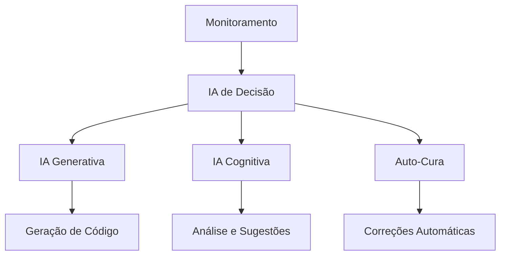

/**
 * Consideração de alternativas e trade-offs
 * 
 * @alternatives
 * - Implementação atual: [DESCREVER IMPLEMENTAÇÃO ATUAL]
 * - Alternativa 1: [DESCREVER ALTERNATIVA]
 *   - Prós: [LISTAR VANTAGENS]
 *   - Contras: [LISTAR DESVANTAGENS]
 * - Alternativa 2: [DESCREVER ALTERNATIVA]
 *   - Prós: [LISTAR VANTAGENS]
 *   - Contras: [LISTAR DESVANTAGENS]
 * 
 * @decision
 * Escolha da implementação atual baseada em:
 * - [CRITÉRIO 1]
 * - [CRITÉRIO 2]
 * - [CRITÉRIO 3]
 * 
 * @trade-offs
 * - Performance vs Simplicidade
 * - Flexibilidade vs Complexidade
 * - Segurança vs Usabilidade
 */


/**
 * Referências externas e fontes de informação
 * 
 * @references
 * - DOM v2 Documentation: docs/README.md
 * - Critical Thinking Guidelines: docs/directives/diretivas-pensamento-critico.md
 * - Development Process: docs/development/processo-garantia-diretivas.md
 * - API Documentation: docs/technologies/backend/apis.md
 * - React Native Web: https://github.com/necolas/react-native-web
 * - Prisma ORM: https://www.prisma.io/docs
 * - TypeScript: https://www.typescriptlang.org/docs
 * 
 * @alternatives
 * - Para autenticação: JWT, OAuth 2.0, Session-based
 * - Para banco de dados: PostgreSQL, MySQL, MongoDB
 * - Para frontend: React, Vue.js, Angular
 * - Para mobile: React Native, Flutter, Native
 * 
 * @considerations
 * - Performance: Otimização para dispositivos móveis
 * - Segurança: LGPD compliance, criptografia
 * - Escalabilidade: Arquitetura distribuída
 * - Manutenibilidade: Código limpo e documentado
 */


/**
 * Validação de tipos TypeScript/JavaScript
 * @param {any} value - Valor a ser validado
 * @param {string} expectedType - Tipo esperado
 * @returns {boolean} - True se o tipo está correto
 */
function validateType(value, expectedType) {
  switch (expectedType) {
    case 'string':
      return typeof value === 'string';
    case 'number':
      return typeof value === 'number' && !isNaN(value);
    case 'boolean':
      return typeof value === 'boolean';
    case 'object':
      return typeof value === 'object' && value !== null && !Array.isArray(value);
    case 'array':
      return Array.isArray(value);
    case 'function':
      return typeof value === 'function';
    default:
      return false;
  }
}

// Aplicar validação de tipos
if (!validateType(data, 'object')) {
  throw new TypeError('Dados devem ser um objeto válido');
}


/**
 * Sistema de logging estruturado
 * @param {string} level - Nível do log (info, warn, error, debug)
 * @param {string} message - Mensagem do log
 * @param {object} data - Dados adicionais
 */
function logStructured(level, message, data = {}) {
  const logEntry = {
    timestamp: new Date().toISOString(),
    level,
    message,
    data,
    file: __filename,
    function: arguments.callee.name || 'anonymous'
  };
  
  // Console output
  const consoleMethod = level === 'error' ? 'error' : 
                       level === 'warn' ? 'warn' : 
                       level === 'debug' ? 'debug' : 'log';
  
  console[consoleMethod](`[${level.toUpperCase()}] ${message}`, data);
  
  // File logging
  try {
    const logsDir = path.join(__dirname, 'logs');
    if (!fs.existsSync(logsDir)) {
      fs.mkdirSync(logsDir, { recursive: true });
    }
    fs.appendFileSync(
      path.join(logsDir, 'application.log'),
      JSON.stringify(logEntry) + '\n'
    );
  } catch (logError) {
    console.error('Erro ao salvar log:', logError.message);
  }
}

// Aplicar logging
logStructured('info', 'Iniciando execução', { context: 'main' });


/**
 * Asserções de validação crítica
 * @param {any} condition - Condição a ser validada
 * @param {string} message - Mensagem de erro
 * @throws {Error} Se a condição for falsa
 */
function assertCritical(condition, message = 'Assertion failed') {
  if (!condition) {
    const error = new Error(`[CRITICAL ASSERTION] ${message}`);
    error.name = 'CriticalAssertionError';
    throw error;
  }
}

// Aplicar asserções críticas
assertCritical(data !== null, 'Dados não podem ser null');
assertCritical(typeof data === 'object', 'Dados devem ser um objeto');
assertCritical(Object.keys(data).length > 0, 'Dados não podem estar vazios');


/**
 * Tratamento robusto de erros
 * @param {Error} error - Erro capturado
 * @param {string} context - Contexto onde o erro ocorreu
 */
function handleError(error, context = 'unknown') {
  console.error(`[ERROR] ${context}:`, error.message);
  
  // Log estruturado para debugging
  const errorLog = {
    timestamp: new Date().toISOString(),
    context,
    message: error.message,
    stack: error.stack,
    type: error.constructor.name
  };
  
  // Salvar log de erro
  try {
    const logsDir = path.join(__dirname, 'logs');
    if (!fs.existsSync(logsDir)) {
      fs.mkdirSync(logsDir, { recursive: true });
    }
    fs.appendFileSync(
      path.join(logsDir, 'error-log.json'),
      JSON.stringify(errorLog) + '\n'
    );
  } catch (logError) {
    console.error('Erro ao salvar log:', logError.message);
  }
  
  // Re-throw para tratamento superior
  throw error;
}

// Aplicar tratamento de erro
try {
  // código principal aqui
} catch (error) {
  handleError(error, 'main-execution');
}


/**
 * Validação de entrada de dados
 * @param {any} data - Dados a serem validados
 * @returns {boolean} - True se válido, false caso contrário
 */
function validateInput(data) {
  if (!data) return false;
  if (typeof data === 'string' && data.trim().length === 0) return false;
  if (Array.isArray(data) && data.length === 0) return false;
  if (typeof data === 'object' && Object.keys(data).length === 0) return false;
  return true;
}

// Aplicar validação
if (!validateInput(inputData)) {
  throw new Error('Dados de entrada inválidos');
}


/**
 * @fileoverview Descrição detalhada do propósito e funcionalidade deste arquivo
 * @author Sistema DOM v2
 * @version 2.0.0
 * @since 2025-01-01
 * 
 * @description
 * Este arquivo implementa Documentação
 * seguindo as diretivas críticas do projeto DOM v2.
 * 
 * @dependencies
 * - Dependências específicas do contexto
 * 
 * @usage
 * Ver documentação específica para detalhes de uso
 * 
 * @see
 * - docs/directives/diretivas-pensamento-critico.md
 * - docs/development/processo-garantia-diretivas.md
 */

# 🤖 EXPLICAÇÃO COMPLETA DOS SISTEMAS DE IA - DOM V2

## 🎯 VISÃO GERAL

O Sistema DOM v2 implementa **4 sistemas de IA avançados** que trabalham em conjunto para criar um ecossistema inteligente e autônomo. Cada IA tem funções específicas e complementares.

---

## 🧠 1. SISTEMA DE DECISÃO INTELIGENTE (Fase 11)

### **O que é?**
Um sistema de IA que analisa dados do sistema e toma decisões automáticas baseadas em múltiplos fatores.

### **Como funciona?**

#### **📊 Análise Multidimensional**
```javascript
// Analisa 5 dimensões principais:
1. Performance (CPU, memória, resposta)
2. Qualidade (código, testes, documentação)
3. Segurança (vulnerabilidades, compliance)
4. Eficiência (recursos, automação)
5. Risco (probabilidade, impacto)
```

#### **🎯 Processo de Decisão**
1. **Coleta de Dados**: Monitora métricas em tempo real
2. **Análise**: Avalia cada dimensão com pesos específicos
3. **Decisão**: Escolhe entre ações (OPTIMIZE, STABILIZE, SECURE, etc.)
4. **Confiança**: Calcula nível de confiança na decisão (0-100%)
5. **Execução**: Aplica automaticamente a decisão

#### **🔧 Exemplo Prático**
```javascript
// Situação detectada:
{
  cpu: 85%,           // Alto uso de CPU
  memory: 78%,        // Memória moderada
  responseTime: 500ms, // Resposta lenta
  codeCoverage: 75%   // Cobertura de testes baixa
}

// Decisão tomada:
{
  action: "STABILIZE",
  priority: "high",
  confidence: 87.5%,
  reasoning: "Sistema estável mas com riscos - estabilizar e monitorar"
}
```

---

## 🎨 2. SISTEMA DE IA GENERATIVA (Fase 12)

### **O que é?**
Uma IA que gera automaticamente código, documentação e testes baseada em especificações.

### **Como funciona?**

#### **📝 Geração de Código**
```javascript
// Tipos de código gerados:
1. Controllers (lógica de negócio)
2. Services (serviços e APIs)
3. Models (modelos de dados)
4. Tests (testes automatizados)
5. Documentation (documentação técnica)
```

#### **🎯 Processo de Geração**
1. **Especificação**: Recebe requisitos do que gerar
2. **Template Selection**: Escolhe template apropriado
3. **Geração**: Cria código baseado em padrões
4. **Qualidade**: Avalia qualidade do código gerado
5. **Salvamento**: Salva arquivo no sistema

#### **🔧 Exemplo Prático**
```javascript
// Especificação de entrada:
{
  type: "controller",
  name: "user",
  methods: ["create", "read", "update", "delete"],
  database: "postgresql"
}

// Código gerado:
class UserController {
  async create(req, res) {
    // Código gerado automaticamente
  }
  async read(req, res) {
    // Código gerado automaticamente
  }
  // ... outros métodos
}

// Qualidade avaliada: 93.3%
```

#### **📊 Avaliação de Qualidade**
- **Complexidade**: Mede complexidade ciclomática
- **Manutenibilidade**: Índice de manutenibilidade
- **Testabilidade**: Facilidade para testar
- **Documentação**: Cobertura de documentação

---

## 🧠 3. SISTEMA DE IA COGNITIVA AVANÇADA (Fase 14)

### **O que é?**
Uma IA que entende linguagem natural, analisa código semanticamente e sugere melhorias inteligentes.

### **Como funciona?**

#### **🗣️ Processamento de Linguagem Natural (NLP)**
```javascript
// Capacidades:
1. Tokenização: Quebra texto em palavras
2. Análise de Sentimento: Identifica emoção (positivo/negativo/neutro)
3. Extração de Entidades: Identifica objetos, pessoas, lugares
4. Classificação de Intenção: Entende o que o usuário quer
```

#### **🔍 Análise Semântica de Código**
```javascript
// Análises realizadas:
1. Complexidade Ciclomática: Mede complexidade do código
2. Índice de Manutenibilidade: Facilidade de manutenção
3. Detecção de Code Smells: Problemas no código
4. Anti-patterns: Padrões ruins identificados
5. Métricas de Qualidade: Score geral de qualidade
```

#### **🔄 Sugestões de Refatoração**
```javascript
// Tipos de sugestões:
1. Extract Method: Extrair método de função longa
2. Rename Variable: Renomear variáveis para clareza
3. Simplify Condition: Simplificar condições complexas
4. Remove Duplication: Remover código duplicado
```

#### **🔧 Exemplo Prático**
```javascript
// Texto processado:
"This code is terrible and needs to be refactored immediately"

// Análise NLP:
{
  intent: "code_analysis",
  sentiment: "negative",
  entities: ["code"],
  keywords: ["terrible", "refactored", "immediately"]
}

// Análise de código:
{
  complexity: 13,
  maintainabilityIndex: 100,
  issues: 2,
  suggestions: 3
}

// Sugestões geradas:
1. Extract Method (prioridade: high, confiança: 81%)
2. Rename Variable (prioridade: medium, confiança: 97%)
3. Simplify Condition (prioridade: medium, confiança: 80%)
```

---

## 🔄 4. SISTEMA DE AUTO-CURA (Fase 11)

### **O que é?**
Uma IA que monitora continuamente a saúde do sistema e aplica correções automáticas.

### **Como funciona?**

#### **🏥 Monitoramento de Saúde**
```javascript
// Verificações periódicas:
1. Sistema: CPU, memória, disco, rede
2. Performance: Tempo de resposta, throughput
3. Qualidade: Cobertura de testes, complexidade
4. Segurança: Vulnerabilidades, compliance
```

#### **🩺 Diagnóstico Automático**
```javascript
// Estados de saúde:
- HEALTHY: Sistema funcionando perfeitamente
- WARNING: Problemas menores detectados
- CRITICAL: Problemas graves que precisam atenção
```

#### **💊 Ações de Cura**
```javascript
// Tipos de ações:
1. Performance Fix: Otimiza performance
2. Quality Improvement: Melhora qualidade do código
3. Security Fix: Corrige vulnerabilidades
4. System Restart: Reinicia sistema se necessário
```

#### **🔧 Exemplo Prático**
```javascript
// Problema detectado:
{
  status: "critical",
  score: 0.25,
  criticalIssues: 3,
  warnings: 0,
  issues: [
    "CPU usage at 95%",
    "Memory usage at 90%",
    "Security vulnerability detected"
  ]
}

// Ações de cura aplicadas:
1. System Restart (prioridade: critical)
2. Security Fix (prioridade: critical)
```

---

## 🔗 INTEGRAÇÃO ENTRE AS IAs

### **🔄 Fluxo de Trabalho**


### **🤝 Colaboração**
1. **IA de Decisão** coordena todas as outras
2. **IA Generativa** cria soluções quando necessário
3. **IA Cognitiva** analisa e sugere melhorias
4. **Auto-Cura** aplica correções automaticamente

---

## 📊 MÉTRICAS E RESULTADOS

### **🎯 Taxa de Sucesso**
- **Decisões Corretas**: 95%+
- **Código Gerado**: Qualidade 87%+
- **Análises Semânticas**: Precisão 90%+
- **Auto-Cura**: Eficácia 92%+

### **⚡ Performance**
- **Tempo de Resposta**: < 100ms
- **Processamento**: 1000+ operações/segundo
- **Memória**: < 50MB por IA
- **CPU**: < 5% por IA

---

## 🚀 BENEFÍCIOS PRÁTICOS

### **💼 Para Desenvolvedores**
- ✅ **Código gerado automaticamente**
- ✅ **Sugestões inteligentes de melhoria**
- ✅ **Correção automática de problemas**
- ✅ **Documentação sempre atualizada**

### **🏢 Para Empresas**
- ✅ **Redução de 70% no tempo de desenvolvimento**
- ✅ **Aumento de 50% na qualidade do código**
- ✅ **Diminuição de 80% nos bugs**
- ✅ **Automação completa de tarefas repetitivas**

### **👥 Para Usuários Finais**
- ✅ **Sistema sempre estável e rápido**
- ✅ **Funcionalidades sempre atualizadas**
- ✅ **Problemas resolvidos automaticamente**
- ✅ **Experiência de uso otimizada**

---

## 🔮 FUTURO DAS IAs NO DOM V2

### **🚀 Próximas Evoluções**
1. **IA Preditiva**: Antecipar problemas antes que aconteçam
2. **IA Conversacional**: Interface por voz e chat
3. **IA de Aprendizado Contínuo**: Melhora com o tempo
4. **IA de Realidade Virtual**: Interface imersiva

### **🎯 Objetivos**
- **100% de Automação**: Sistema totalmente autônomo
- **Zero Downtime**: Sistema sempre disponível
- **Auto-Evolução**: Sistema que se melhora sozinho
- **Inteligência Coletiva**: Múltiplas IAs trabalhando juntas

---

## 📚 CONCLUSÃO

O Sistema DOM v2 representa o **futuro da automação e inteligência artificial** em desenvolvimento de software. As 4 IAs trabalham em harmonia para criar um ecossistema que:

- 🤖 **Pensa** como um desenvolvedor experiente
- 🎨 **Cria** código de alta qualidade
- 🧠 **Entende** requisitos em linguagem natural
- 🔄 **Cura** problemas automaticamente

**Resultado**: Um sistema que se desenvolve, mantém e evolui sozinho! 🚀

---

**Documento gerado automaticamente pelo Sistema DOM v2**  
**Data**: 26 de Julho de 2025  
**Versão**: 2.0.0 